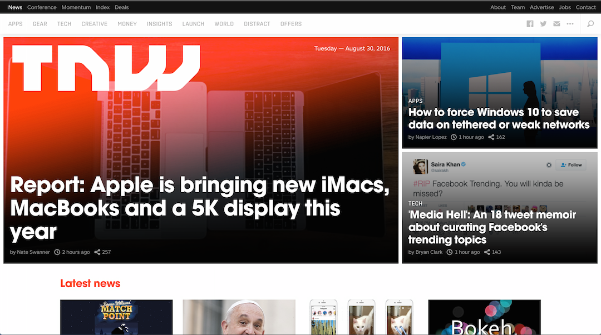
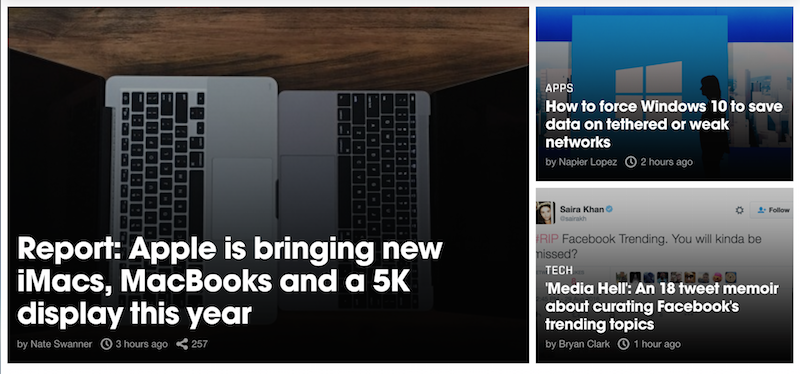
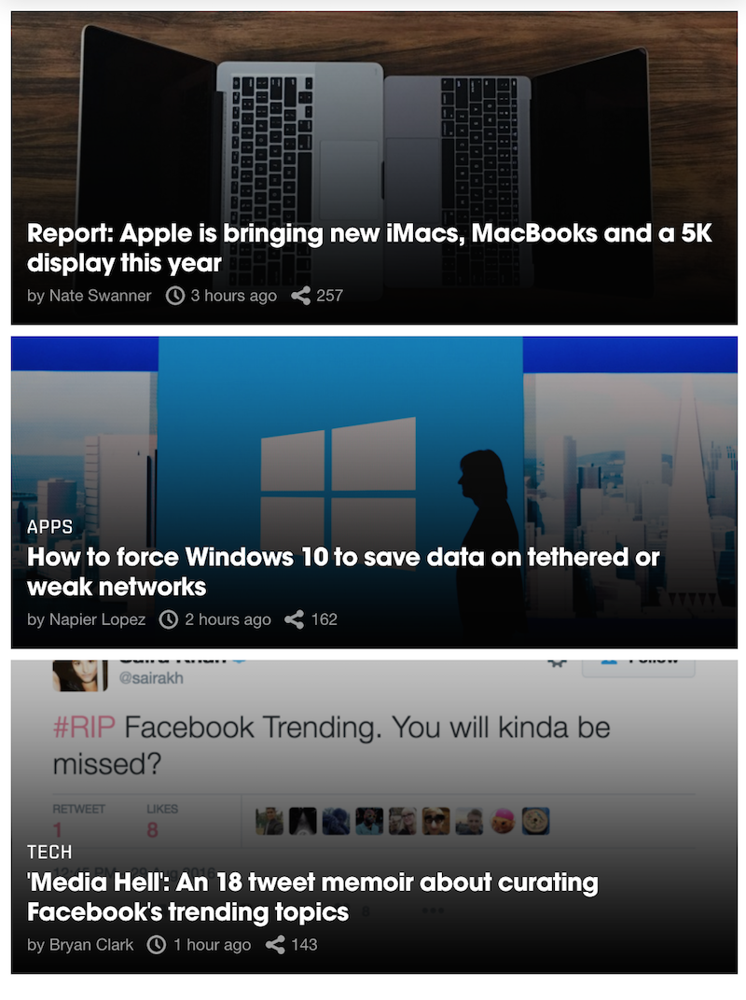
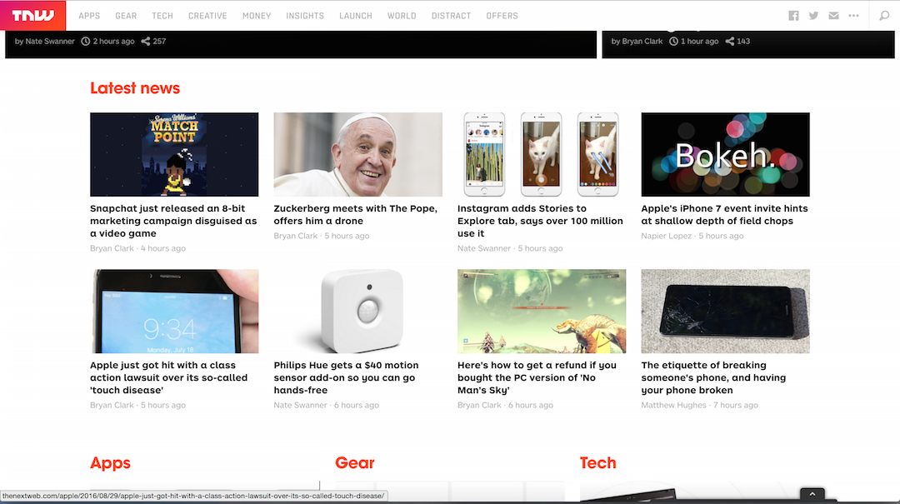
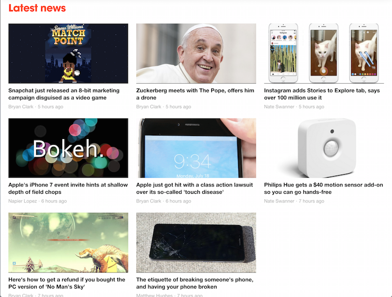
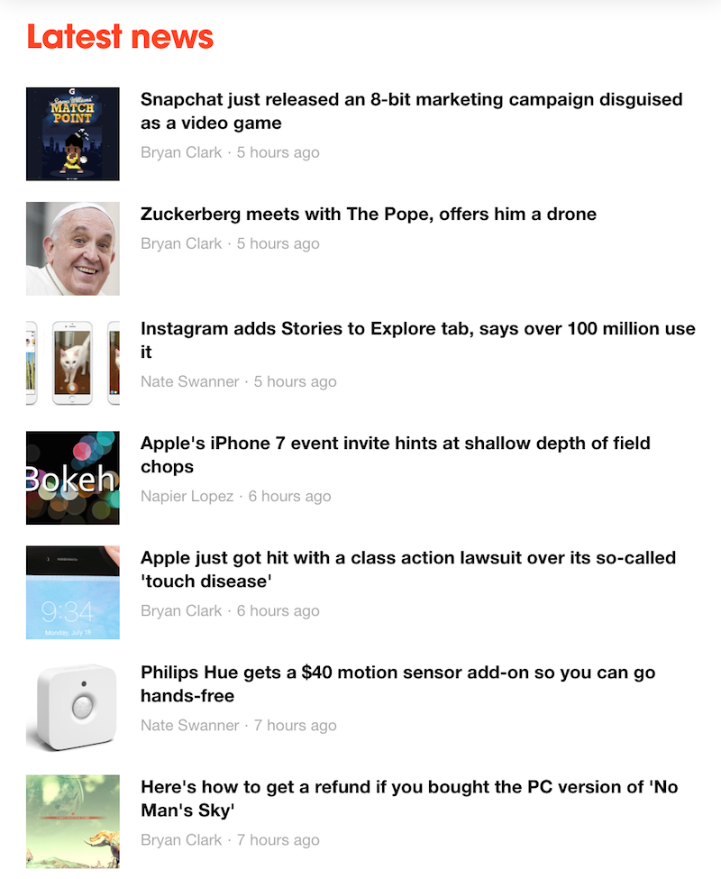
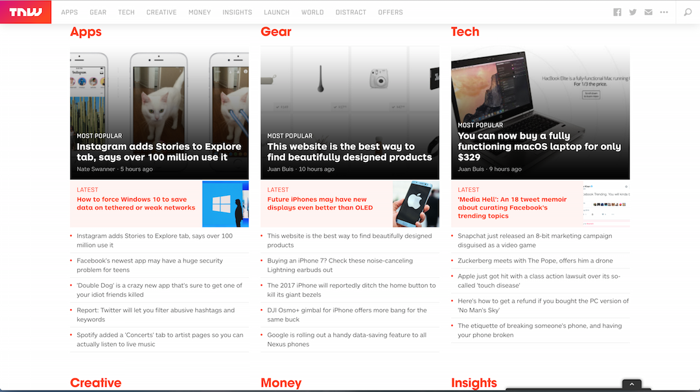
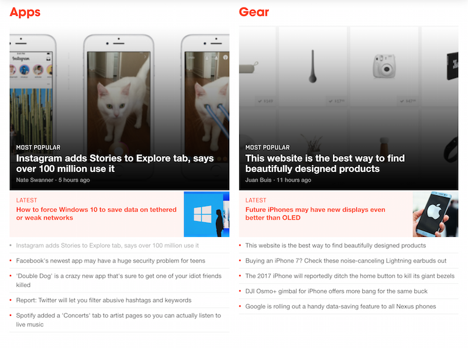
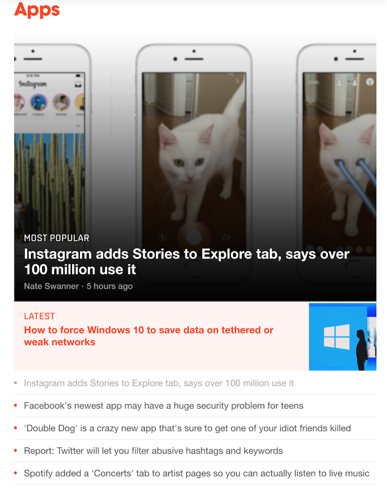

## Bootstrap Site Replication

### Introduction

**Note: Please refer to the screenshots as a requirement at `images/screenshots`**

We then introduced a HTML and CSS library, called Bootstrap. It's a library that helps you create a beautiful responsive front-end.

### Getting Started

  1. Add bootstrap
  1. Start Coding in `index.html`

### Instructions

  **Keep in mind, you need to code for different size of browser!!!!**

  1. Section 1 & 2
    - try Section 2 first to get the feel, then try Section 1
  1. Section 3 (Bonus | Easy)
  1. Navbar (Bonus | Hard)

### Deliverable

